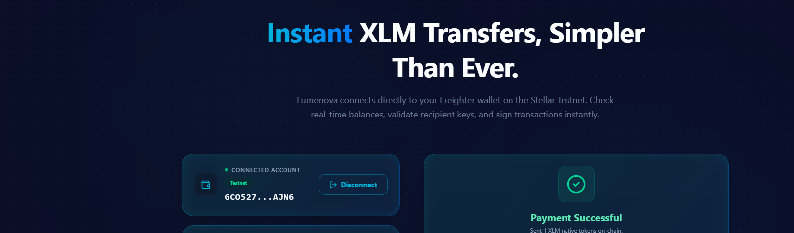
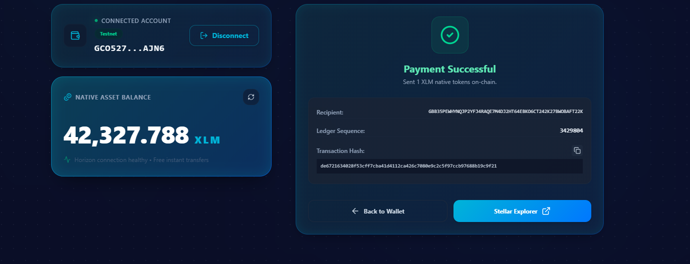
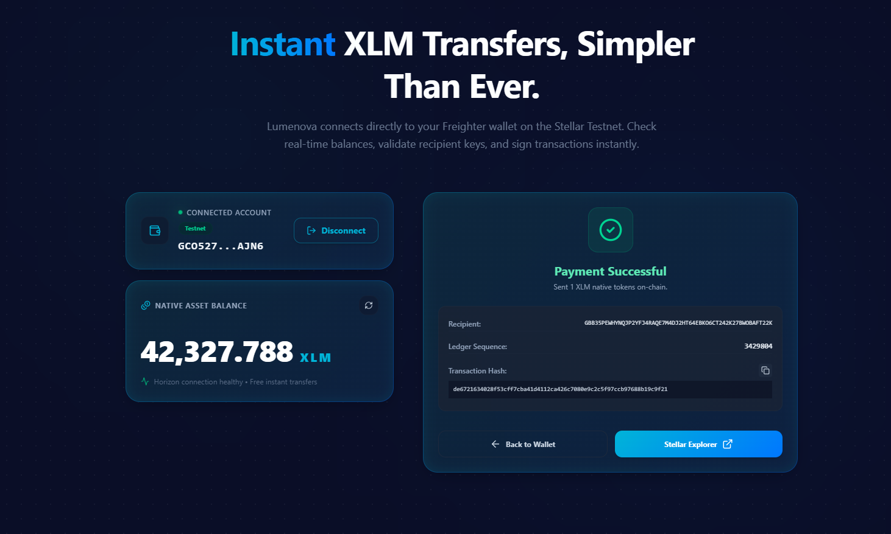
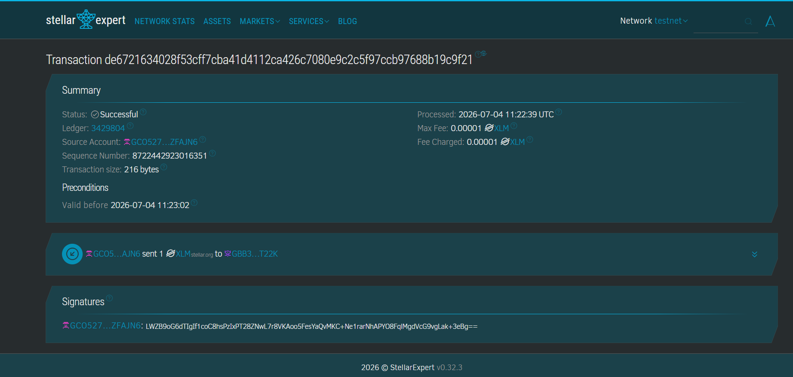

# Lumenova | Simple XLM Payment dApp

Lumenova is a real-time, non-custodial decentralized application (dApp) built on the **Stellar Testnet**. It enables users to securely connect their Freighter browser wallet, check native Lumen (XLM) balances, and send instant, peer-to-peer payments on-chain.

No simulated or fake data is used—every wallet connection, balance lookup, and transaction submission occurs on the live Stellar Testnet ledger.

---

## ✨ Features

- **Freighter Wallet Integration**: Connect and disconnect Freighter securely. The application handles Freighter installation checks and displays truncated public keys.
- **Active Network Auditing**: Detects if your Freighter wallet is set to Mainnet or other networks and warns you to switch to Testnet to prevent lost assets.
- **Real-Time Balance Display**: Fetches live XLM balances from the Horizon Testnet server with an on-demand refresh mechanism.
- **Smart Friendbot Funding**: Identifies unfunded (new) accounts and provides a one-click button to automatically request 10,000 XLM from Friendbot, plus a manual backup link.
- **Peer-to-Peer Payments**: Constructs native XLM payment operations, requests signatures via Freighter, and submits them to the Stellar network.
- **Instant Transaction Feedback**: Displays real transaction hashes with links to the Stellar Expert explorer upon success. Handles signatures rejection, ledger failures, and reserve errors gracefully.

---

## 🛠️ Tech Stack

- **Frontend Framework**: React 19 (via Vite 8)
- **Styling & Assets**: TailwindCSS v4 & Lucide React Icons
- **Wallet Connection API**: `@stellar/freighter-api`
- **Stellar Blockchain SDK**: `stellar-sdk` (Horizon Testnet endpoint)

---

## 🚀 Setup & Installation

Follow these steps to run the project locally on your machine:

### 1. Prerequisites
- [Node.js](https://nodejs.org/) (version 18 or above recommended)
- [Freighter Wallet Extension](https://www.freighter.app/) installed in your browser

### 2. Clone and Install Dependencies
Navigate into your project folder and run:
```bash
npm install
```

### 3. Environment Configuration
Create a `.env` file in the root of the project (an example `.env.example` has been provided):
```env
VITE_HORIZON_URL=https://horizon-testnet.stellar.org
VITE_NETWORK_PASSPHRASE=Test SDF Network ; September 2015
```

### 4. Run the Development Server
Start the local server with:
```bash
npm run dev
```
Open [http://localhost:5173](http://localhost:5173) in your browser to view the dApp.

### 5. Build for Production
To create a production-ready build:
```bash
npm run build
```

---

## 📸 Screenshots

### 1. Wallet Connected State

*Description: Displays the connected Freighter public key (truncated) and active network indicator.*

### 2. Balance Displayed

*Description: Shows the live XLM balance loaded from the Testnet Horizon server, complete with the manual and automatic Friendbot options for new wallets.*

### 3. Successful Transaction

*Description: Shows the success modal with recipient details, ledger sequence, transaction hash, copy button, and link to Stellar Expert.*

### 4. Transaction Result & Explorer Verification

*Description: Explorer detail page on Stellar Expert showing the successful ledger execution of your testnet payment.*

### 5. Explorer Verification Link
[Verify on Stellar Expert](https://stellar.expert/explorer/testnet/tx/de6721634028f53cff7cba41d4112ca426c7080e9c2c5f97ccb97688b19c9f21)

---

## 🧪 Verification & Testing Flow

1. **Install Freighter**: Download from [freighter.app](https://www.freighter.app/) and create an account.
2. **Switch to Testnet**: Open the Freighter extension, click the gear icon (Settings), select **Network**, and choose **Testnet**.
3. **Connect Wallet**: Click **Connect Freighter Wallet** on Lumenova. Your truncated public key will appear in the wallet card.
4. **Fund (if new)**: If you see "Account Not Funded", click the **Fund with Friendbot** button. Within seconds, your balance will update to **10,000.00 XLM**.
5. **Send Payment**:
   - Paste a valid Testnet public key as the recipient.
   - Enter an amount (e.g., `5` XLM).
   - Click **Confirm Payment**.
   - Approve the transaction popup in your Freighter extension.
6. **Verify Explorer**: Click **Stellar Explorer** on the success screen to view your live payment transaction on the blockchain!

---

## 📄 License
Licensed under the [MIT License](LICENSE).
